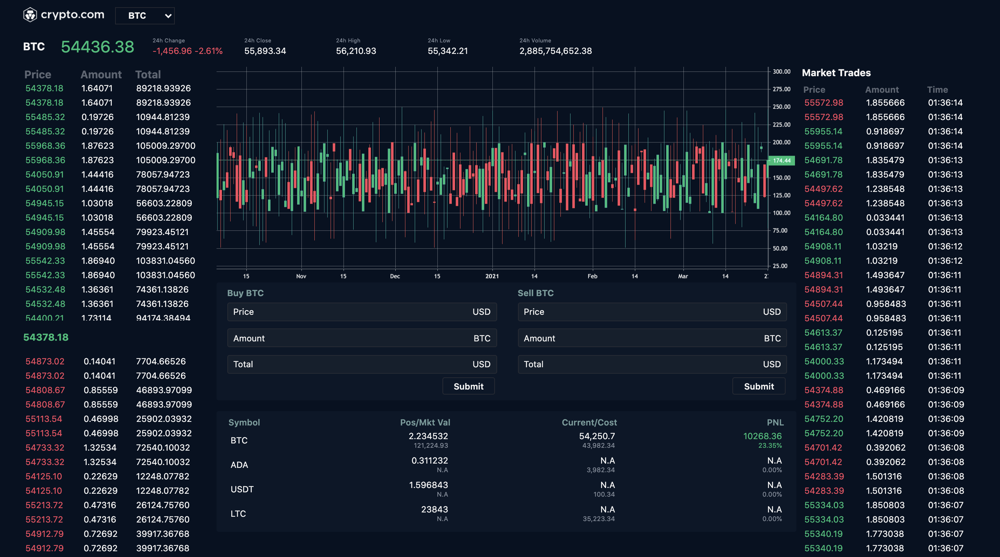

# Angular
This project was generated with [Angular CLI](https://github.com/angular/angular-cli) version 11.2.5.

# Install Package
Run `npm install` to install package

# Build
Run `ng build` or `npm build` to build the project. 

# Start server
Run `ng serve` or `npm start` for a dev server. Navigate to `http://localhost:4200/`. The app will automatically reload if you change any of the source files.

# Description
This is a mock real-time crypto trading dashboard and contains contains 6 widgets:
- overview widge: yesterday high/low/close price and current price
- candlestick widget: show history high/low/close price
- position widget: postion and pnl
- order entry widget: place order
- order book widget: real-time all placed orders
- trade widget: real-time market traded orders

